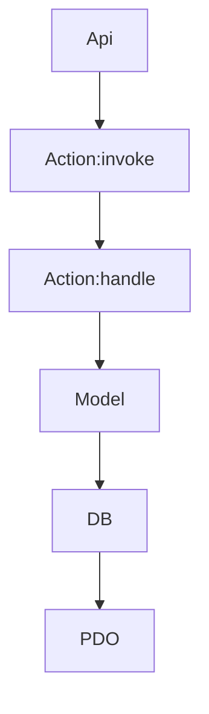

# Terra todo app

## Requerimientos

- PHP >= 8.4.11
- Base de datos mysql
  - Si no se tiene un mysql local y se tiene docker instalado se puede usar e instalar la base de datos con

```bash
docker run --rm --name mysql-container -e MYSQL_ROOT_PASSWORD=password -p 3306:3306 -d mysql:8.0
```

Para revisar el contenedor

```bash
docker ps
```

Para eliminar el contenedor (se eliminaran los datos)

```bash
docker stop mysql-container && docker rm mysql-container
```

## Instalacion

1. Clonar y entrar al proyecto

```bash
git clone https://github.com/cmpere/terra_xm_todo_app.git && cd terra_xm_todo_app
```

2. Copia el archivo `.env-example` a `.env` y agrega los datos de la conexion a la base de datos

```bash
cp .env-example .env
```

3. Crea base de datos si no existe y corre las migraciones

```bash
php migrate.php
```

4. Llenar los datos de prueba

```bash
migrate-seed.php
```

5. Iniciar aplicacion

```
php -S localhost:8000 -t public
```

## Notas

Para limpiar las tablas en la base ejecuta rollback

```bash
php migrate-rollback.php
```



# Criterios de aceptación

## Base de datos (MySQL):

- ~~○ Crea una base de datos MySQL con una tabla llamada tasks (tareas).~~ **Cubierto con las migraciones.**
- ~~○ La tabla tasks debe tener los siguientes campos:~~ **Cubierto con las migraciones.**
  - ~~■ id (INT, clave primaria, auto-incremento)~~
  - ~~■ task_name (VARCHAR)~~
  - ~~■ created_at (TIMESTAMP, valor predeterminado de la hora actual)~~

> Codigo relacionado
>
> - [migrate.php](migrate.php)
> - [migrate-seed.php](migrate-seed.php)
> - [src/Support/DB.php](src/Support/DB.php)
> - [migrate-rollback.php](migrate-rollback.php)
> - [database/seeders/todo_seeder.php](database/seeders/todo_seeder.php)
> - [database/migrations/migrate_todo_table.php](database/migrations/migrate_todo_table.php)

## Backend (PHP):

- ~~○ Implementa scripts en PHP para manejar las operaciones CRUD.~~ [src/Support/DB.php](src/Support/DB.php), [src/Support/Model.php](src/Support/Model.php)
- ~~○ Conéctate a la base de datos MySQL usando PHP (PDO o MySQLi).~~ [src/Support/DB.php](src/Support/DB.php)
- ~~○ Crea las siguientes páginas:~~
  - ~~■ index.php: Muestra una lista de todas las tareas e incluye enlaces para editarlas o eliminarlas.~~ [public/index.php](public/index.php)
  - ~~■ add.php: Un formulario para añadir una nueva tarea.~~ [resources/partials/add.php](resources/partials/add.php)
  - ~~■ edit.php: Un formulario para editar una tarea existente.~~ [public/edit.php](public/edit.php), [resources/partials/edit-form.php](resources/partials/edit-form.php)
  - ~~■ Usa un archivo separado para las configuraciones de conexión a la base de datos (db.php).~~ [.env-example](.env-example)

## Frontend (HTML/CSS/jQuery):

- ~~○ Usa HTML y CSS para crear una interfaz de usuario simple para la gestión de tareas.~~ [public/index.php](public/index.php), [public/edit.php](public/edit.php), [resources/partials](resources/partials)
- ~~○ Usa jQuery para añadir interacción básica:~~ [public/dist](public/dist)
  - ~~■ Muestra un diálogo de confirmación antes de eliminar una tarea.~~ [public/index.php](public/index.php)
  - ~~■ Implementa AJAX para gestionar la creación de tareas sin recargar la página.~~ [resources/partials/add.php](resources/partials/add.php), [public/dist/app.js](public/dist/app.js)

# Tarea Extra: Diseño Responsivo

- ~~● Haz que la aplicación de la Lista de Tareas sea responsiva usando CSS (Flexbox o Grid).~~ **Uso de tailwind** [resources/partials/head.php](resources/partials/head.php)
- ~~● Asegúrate de que la aplicación funcione bien tanto en dispositivos móviles como en ordenadores de escritorio.~~ **Se aplica una configuracion repsonsiva con el breakpoint del viewport y un diseño generico con adaptando el largo de la lista al dispositivo** [resources/partials/list.php](resources/partials/list.php)

# Entregables:

1. ~~Enlace al repositorio Git con el proyecto.~~
2. ~~Archivo SQL para crear la tabla tasks (por ejemplo, tasks.sql).~~ Cubierto con: [database/migrations/migrate_todo_table.php](database/migrations/migrate_todo_table.php)
3. ~~Instrucciones sobre cómo configurar y ejecutar la aplicación.~~
