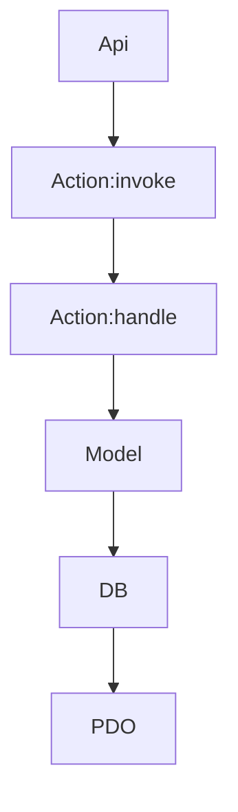

# Terra todo app

## Requerimientos

- PHP >= 8.4.11
- Base de datos mysql
  - Si no se tiene un mysql local y se tiene docker instalado se puede usar e instalar la base de datos con

```bash
docker run --rm --name mysql-container -e MYSQL_ROOT_PASSWORD=password -p 3306:3306 -d mysql:8.0
```

Para revisar el contenedor

```bash
docker ps
```

Para eliminar el contenedor (se eliminaran los datos)

```bash
docker stop mysql-container && docker rm mysql-container
```

## Instalacion

1. Clonar y entrar al proyecto

```bash
git clone https://github.com/cmpere/terra_xm_todo_app.git && cd terra_xm_todo_app
```

2. Copia el archivo `.env-example` a `.env` y agrega los datos de la conexion a la base de datos

```bash
cp .env-example .env
```

3. Crea base de datos si no existe y corre las migraciones

```bash
php migrate.php
```

4. Llenar los datos de prueba

```bash
migrate-seed.php
```

5. Iniciar aplicacion

```
php -S localhost:8000 -t public
```

## Notas

Para limpiar las tablas en la base ejecuta rollback

```bash
php migrate-rollback.php
```


